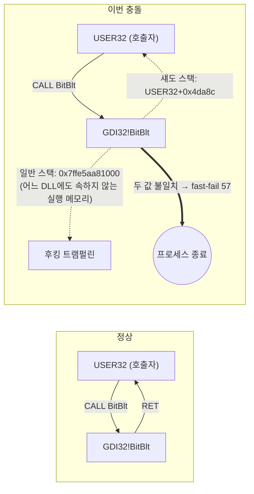

[English](README.md) | **한국어**

# Chrome이 켜지자마자 죽는다: 한국 웹 보안 프로그램과 CET 섀도 스택의 충돌

> **요약.** 정부 사이트를 쓰려고 보안 프로그램 묶음을 설치한 직후부터 Chrome이 실행 즉시 종료됐습니다. 재설치로는 고쳐지지 않았습니다. 이벤트 로그, Chrome 충돌 덤프 32개, 시스템 DLL 역분석으로 원인을 좁혔습니다. **TouchEn nxWeb의 `TENXWGuard64_051.dll`이 `gdi32!BitBlt`의 복귀 주소를 자기 코드로 바꿔치기**합니다. 그러면 **Intel CET 하드웨어 섀도 스택**이 이를 공격으로 판단해 프로세스를 강제 종료합니다(`0xC0000409`, fast-fail 코드 57). 해당 프로그램 하나를 제거해 해결했고, 남은 다른 보안 모듈은 그대로 둔 채 Chrome이 정상 작동하는 것으로 원인을 확정했습니다.

| 항목 | 내용 |
|---|---|
| 증상 | Chrome 창이 뜨기 전에 종료. 재설치해도 같음 |
| 영향 범위 | Chrome, 원격 데스크톱(`msrdc.exe`), Windows 업데이트 알림(`MoNotificationUx.exe`) |
| 근본 원인 | 화면 캡처 방지용 API 후킹이 하드웨어 스택 보호(CET)와 호환되지 않음 |
| 결정적 증거 | 충돌 덤프 32/32건 동일 지점(`GDI32!BitBlt`의 `RET`). 32/32건에 `TENXWGuard64_051.dll` 로드. 스택과 섀도 스택의 복귀 주소 불일치 |
| 해결 | TouchEn nxWeb 제거. Chrome 재설치는 효과 없음 |
| 신고 | Chromium 이슈 [568337124](https://issues.chromium.org/issues/568337124) (2026-10-02) |
| 환경 | Windows 11 빌드 26200.9457, Intel Core i5-13500(CET 지원), Chrome 154.0.8037.58 → .93 |

---

## 1. 증상

- Chrome 아이콘을 누르면 창이 나타나기 전에 프로세스가 끝납니다. 오류 창도 없습니다.
- Chrome을 삭제하고 최신 버전(154.0.8037.93)으로 다시 설치해도 그대로였습니다.
- Windows 이벤트 로그(Application, ID 1000)에는 매번 같은 기록이 남았습니다.

```
Faulting application name: chrome.exe, version: 154.0.8037.93
Faulting module name: GDI32.dll, version: 10.0.26100.8328
Exception code: 0xc0000409
Fault offset: 0x0000000000004b17
```

## 2. 조사 과정

진단을 가설을 하나씩 지워 나가는 순서로 정리했습니다. 각 단계에서 무엇을 보고 무엇을 버렸는지 남깁니다.

### 2.1 "Chrome 문제인가?" → 아니다

같은 기간의 충돌 로그를 모듈 기준으로 묶었습니다.

| 프로그램 | 충돌 수 | 충돌 지점 |
|---|---|---|
| chrome.exe 154.0.8037.58 | 28 | `GDI32.dll+0x4b17` |
| chrome.exe 154.0.8037.93 (재설치 후) | 7 | `GDI32.dll+0x4b17` |
| MoNotificationUx.exe (Windows 업데이트 알림) | 3 | `GDI32.dll+0x4b17` |
| msrdc.exe (원격 데스크톱) | 3 | `GDI32.dll+0x4b17` |

서로 다른 회사가 만든 세 프로그램이 **같은 DLL의 같은 바이트**에서 죽습니다. Chrome 버그가 아니라 시스템 공통 요인입니다. 재설치가 효과 없던 이유도 여기서 설명됩니다.

### 2.2 "언제부터인가?" → 10월 1일 06:09

- 지난 30일 동안 GDI32 충돌은 **0건**이었습니다. 첫 충돌은 2026-10-01 06:09:54입니다.
- 그 무렵 바뀐 것을 찾았습니다. 서비스 설치 기록(System, ID 7045)과 설치 프로그램 목록을 봤습니다.

| 시각 | 사건 |
|---|---|
| 06:05:58 | 서비스 설치: Kings Online Security (KOS) |
| 06:07:00 | 서비스 설치: **TENXW_Guard** (TouchEn nxWeb) |
| 06:07:13 | 서비스 설치: CrossEX Live Checker |
| **06:09:54** | **Chrome 첫 충돌** |

정부 사이트 이용을 위해 받은 보안 프로그램 묶음이 3분 안에 깔렸고, 그 직후부터 충돌이 시작됐습니다. 이 단서는 "정부 프로그램을 깐 뒤로 이상해졌다"는 제 관찰에서 나왔습니다. 로그만 보던 단계에서는 그래픽 드라이버, 글꼴 캐시, 업데이트 불일치 같은 일반적인 가설을 먼저 보고 있었습니다.

### 2.3 "GDI32 어디서 죽는가?" → `BitBlt`의 `RET`

`gdi32.dll`의 x64 함수 범위 표(`.pdata`)와 export 표로 오프셋 `0x4b17`을 찾았습니다([`analysis/locate_fault.py`](analysis/locate_fault.py)).

```
function ['BitBlt'] range 0x4a50-0x4b6b, offset into function 0xc7
bytes before fault: 00 00 00 48 83 c4 60 5f     ; add rsp,60h / pop rdi
byte at fault     : c3                          ; RET
```

충돌 위치는 `BitBlt`(화면 영역을 비트맵으로 복사하는 함수) **안의 연산이 아니라 마지막 `RET`(함수 복귀) 명령**입니다. 계산 중 잘못된 메모리를 건드린 것이 아니라, **돌아갈 주소 자체**가 문제라는 뜻입니다.

### 2.4 "왜 RET에서 죽는가?" → CET 섀도 스택 위반

예외 코드 `0xC0000409`는 이름(`STATUS_STACK_BUFFER_OVERRUN`)과 달리 Windows의 **fast-fail**(즉시 강제 종료) 전체에 쓰입니다. 실제 사유는 첫 번째 예외 인자에 들어 있습니다. 덤프 32개 모두 이 값이 `0x39`(57)였고, Windows SDK `winnt.h`에서 확인했습니다.

```c
#define FAST_FAIL_CONTROL_INVALID_RETURN_ADDRESS    57
```

**Intel CET(Control-flow Enforcement Technology) 섀도 스택**이 막은 것입니다.

- CPU는 `CALL`할 때 복귀 주소를 일반 스택과 별도의 **섀도 스택**(프로그램이 쓸 수 없는 보호 메모리)에 함께 적습니다.
- `RET` 때 두 값을 비교해 다르면 복귀 주소 조작 공격(ROP)으로 보고 프로세스를 끝냅니다.
- Windows에서는 실행 파일이 `CETCOMPAT` 표시를 달고 있을 때만 켜집니다.

PE 헤더를 확인해 보니 **충돌한 프로그램만 CET가 켜져 있었습니다.**

| 실행 파일 | CETCOMPAT | 충돌 |
|---|---|---|
| chrome.exe | ✅ | ✅ |
| msrdc.exe | ✅ | ✅ |
| msedge.exe | ✅ | (이번에 실행 안 함) |
| notepad.exe | ❌ | ❌ |
| explorer.exe | ❌ | ❌ |

같은 후킹이 모든 프로그램에 들어가도, CET를 켠 최신 프로그램만 죽는 이유가 이것입니다.

### 2.5 "누가 복귀 주소를 바꿨는가?" → 충돌 덤프로 확정

Chrome은 충돌할 때마다 Crashpad 미니덤프를 남깁니다. 남아 있던 32개를 [`minidump`](https://github.com/skelsec/minidump) 라이브러리로 파싱했습니다([`analysis/analyze_dumps.py`](analysis/analyze_dumps.py), 결과 [`data/crashes.csv`](data/crashes.csv)). 덤프마다 아래 값을 뽑았습니다.

1. 충돌 스레드의 `RSP`가 가리키는 값: `RET`이 실제로 돌아가려던 **일반 스택의 복귀 주소**
2. 예외 인자 2번(섀도 스택 포인터)이 가리키는 값: CPU가 기억하는 **진짜 복귀 주소**
3. 로드된 모듈 목록



결과 (32/32 덤프 공통):

| 값 | 결과 |
|---|---|
| 충돌 지점 | `GDI32.dll+0x4b17` (`BitBlt`의 `RET`) |
| fast-fail 코드 | 57 (`CONTROL_INVALID_RETURN_ADDRESS`) |
| 섀도 스택 복귀 주소 (진짜) | `USER32.dll` 또는 `IMGSF50Filter_x64.dll` 안. 둘 다 `BitBlt`를 정상 호출한 쪽 |
| 일반 스택 복귀 주소 (조작됨) | **어느 모듈에도 속하지 않는 주소**. `MEM_PRIVATE` + 실행 권한 메모리(런타임에 할당한 코드). GDI32 바로 뒤 주소 대역 |
| 로드된 외부 보안 모듈 | **32/32건에 `TENXWGuard64_051.dll`** (TouchEn nxWeb). 15건에는 `IMGSF50Filter_x64.dll`도 있음 |
| KOS 모듈 | **0건** |

"GDI32 근처에 실행 메모리를 따로 할당하고, 함수의 복귀 주소를 그곳으로 돌리는 것"은 **함수가 끝난 직후 결과를 가로채는 후킹**의 전형적인 구현입니다. 화면 캡처 방지 프로그램은 `BitBlt`가 복사한 화면 내용을 지우거나 가리기 위해 이렇게 합니다. CET가 없던 시절에는 문제없이 돌았지만, CET 환경에서는 바로 이 동작이 공격으로 판정됩니다.

### 2.6 용의자 구분: 세 보안 모듈 중 무엇인가

후킹을 하는 보안 모듈이 셋이었습니다. 하나씩 따로 떼어 확인했습니다.

| 모듈 | 설치 시점 | 덤프에 등장 | 제거 / 유지 결과 | 판정 |
|---|---|---|---|---|
| Kings Online Security | 10/01 06:05 | 0/32 | 먼저 제거 → **여전히 충돌** | 무관 |
| MarkAny Image SAFER 5.0 (`IMGSF50Filter_x64.dll`) | 10/01 이전부터 있었음 | 15/32 | **유지한 채 Chrome 정상** (현재도 Chrome에 로드되어 있음) | 단독으로는 무관 |
| **TouchEn nxWeb** (`TENXWGuard64_051.dll`) | 10/01 06:07 | **32/32** | **제거 → 즉시 정상** | **원인** |

- **필요조건:** TouchEn을 빼자 충돌이 멈췄습니다.
- **다른 후보 배제:** Image SAFER는 10월 1일 이전에도 있었고 그때 충돌이 없었습니다. 지금도 Chrome 프로세스 안에 로드된 상태로 정상 작동합니다. KOS는 덤프에 한 번도 나오지 않았고, 제거해도 바뀐 것이 없었습니다.

## 3. 해결

1. **TouchEn nxWeb** 제거(서비스 `TENXW_Guard`, `C:\Program Files\RaonSecure\NxWeb` 삭제 확인)
2. Chrome 실행 → 정상. 충돌 로그 추가 없음

효과 없었던 조치(기록용):
- Chrome 삭제 후 재설치: 원인이 Chrome 밖에 있으므로 무효
- KOS 제거: 덤프에 없던 모듈이므로 무효

## 4. 배운 점

- **같은 오프셋에서 여러 프로그램이 죽으면 그 프로그램들 탓이 아니다.** 공통 분모(DLL, 드라이버, 주입 모듈)를 찾는다.
- **`0xC0000409`는 "버퍼 오버런"이 아닐 수 있다.** 첫 예외 인자의 fast-fail 코드부터 본다. 57이면 CET 섀도 스택 위반이다.
- **충돌 위치가 `RET`이면 복귀 주소를 의심한다.** 일반 스택과 섀도 스택의 값을 비교하면 누가 조작했는지가 드러난다.
- **"언제부터"는 가장 값싼 증거다.** 서비스 설치 이벤트(ID 7045)와 첫 충돌 시각을 나란히 놓으면 후보가 몇 개로 줄어든다.
- **보안 프로그램끼리, 그리고 OS 보안 기능과 충돌한다.** 화면 캡처 방지를 위해 시스템 API를 후킹하는 방식은 CET·CFG 같은 최신 OS 보호와 근본적으로 맞지 않는다. 사용자는 "정부 사이트를 쓰려면 깔아야 하는 프로그램"이 브라우저를 망가뜨리는 상황을 겪는다.

## 5. 다시 해 보기

```powershell
# 1) 충돌 기록: 같은 모듈·오프셋에서 죽는 프로그램 묶기
Get-WinEvent -FilterHashtable @{LogName='Application'; Id=1000} |
  Where-Object Message -match 'GDI32' | ForEach-Object { ($_.Message -split "`n")[0] } | Group-Object

# 2) 그 무렵 설치된 서비스
Get-WinEvent -FilterHashtable @{LogName='System'; Id=7045; StartTime=(Get-Date).AddDays(-7)}
```

```bash
pip install pefile minidump
# 3) 오프셋 → 함수·명령
python analysis/locate_fault.py C:\Windows\System32\gdi32.dll 0x4b17
# 4) Chrome 충돌 덤프 → 복귀 주소·섀도 스택·주입 모듈
python analysis/analyze_dumps.py "%LOCALAPPDATA%\Google\Chrome\User Data\Crashpad\reports" crashes.csv
```

덤프 원본(`*.dmp`)은 프로세스 메모리를 담고 있어 이 저장소에 올리지 않았습니다. `data/crashes.csv`는 거기서 뽑은 주소·모듈 이름만 담고 있습니다.

## 6. 한계

- 트램펄린 메모리의 내용은 미니덤프에 포함되지 않아, 그 코드가 `TENXWGuard64_051.dll`에서 왔다는 것을 바이트 수준으로 직접 보이지는 못했습니다. 판정은 등장 빈도(32/32), 설치 시점, 제거 실험, 다른 후보 배제를 근거로 했습니다.
- TouchEn을 다시 설치해 재현하는 실험은 하지 않았습니다(작업 PC 보호).
- 첫 덤프 1건에 나온 `kdfnpmbr.dll`은 출처를 확인하지 못했습니다. 이후 덤프에는 나오지 않아 판정에 영향은 없습니다.

## 도구

PowerShell(이벤트 로그·서비스·PE 서명 확인), Python `pefile`·`minidump`, Windows SDK 헤더.

## 과정 일기

조사 과정을 시간순으로 적은 기록(헛걸음 포함): [docs/journal.md](docs/journal.md)
