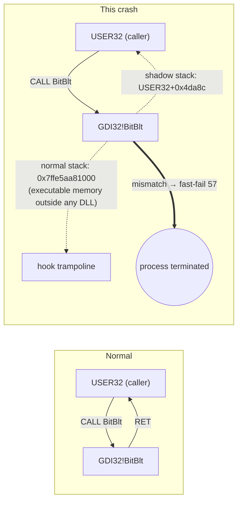

**English** | [한국어](README.ko.md)

# Chrome dies on launch: a Korean web-security hook vs. the CET shadow stack

> **TL;DR.** Right after installing a bundle of security programs required by a Korean government website, Chrome began exiting immediately on launch. Reinstalling Chrome did not help. Using event logs, 32 Chrome crash dumps, and a look inside a system DLL, I traced the cause. **TouchEn nxWeb's `TENXWGuard64_051.dll` redirects the return address of `gdi32!BitBlt` to its own code.** **Intel CET's hardware shadow stack** treats that as a control-flow attack and kills the process (`0xC0000409`, fast-fail code 57). Removing that one program fixed it. The cause was confirmed by Chrome running normally while another hooking security module stayed loaded inside it.

| Item | Detail |
|---|---|
| Symptom | Chrome exits before any window appears; same after reinstall |
| Affected | Chrome, Remote Desktop client (`msrdc.exe`), Windows Update notifier (`MoNotificationUx.exe`) |
| Root cause | API hooking used for screen-capture protection is incompatible with hardware-enforced stack protection (CET) |
| Key evidence | 32/32 dumps fault at the same spot (`RET` of `GDI32!BitBlt`); 32/32 have `TENXWGuard64_051.dll` loaded; the stack and shadow stack disagree on the return address |
| Fix | Uninstall TouchEn nxWeb. Reinstalling Chrome had no effect |
| Environment | Windows 11 build 26200.9457, Intel Core i5-13500 (CET capable), Chrome 154.0.8037.58 → .93 |

---

## 1. Symptom

- Clicking the Chrome icon ends the process before a window appears, with no error dialog.
- Uninstalling Chrome and installing the latest build (154.0.8037.93) changed nothing.
- The Windows Application log (event ID 1000) recorded the same entry every time:

```
Faulting application name: chrome.exe, version: 154.0.8037.93
Faulting module name: GDI32.dll, version: 10.0.26100.8328
Exception code: 0xc0000409
Fault offset: 0x0000000000004b17
```

## 2. Investigation

The investigation is written as a chain of hypotheses ruled out one at a time, recording what was examined at each step and what was discarded.

### 2.1 Is it a Chrome bug? No.

I grouped crash events from the same period by faulting module.

| Program | Crashes | Fault location |
|---|---|---|
| chrome.exe 154.0.8037.58 | 28 | `GDI32.dll+0x4b17` |
| chrome.exe 154.0.8037.93 (after reinstall) | 7 | `GDI32.dll+0x4b17` |
| MoNotificationUx.exe (Windows Update notifier) | 3 | `GDI32.dll+0x4b17` |
| msrdc.exe (Remote Desktop) | 3 | `GDI32.dll+0x4b17` |

Three programs from different vendors die at **the same byte of the same DLL**. That points to a shared system-level factor, not Chrome, and explains why reinstalling did nothing.

### 2.2 When did it start? Oct 1, 06:09.

- Over the previous 30 days there were **zero** GDI32 crashes. The first one was at 2026-10-01 06:09:54.
- I checked what changed around then, using service installation events (System log, ID 7045) and the installed-programs list.

| Time | Event |
|---|---|
| 06:05:58 | Service installed: Kings Online Security (KOS) |
| 06:07:00 | Service installed: **TENXW_Guard** (TouchEn nxWeb) |
| 06:07:13 | Service installed: CrossEX Live Checker |
| **06:09:54** | **First Chrome crash** |

A bundle of security programs for a government website was installed within three minutes, and the crashes started right after. This lead came from my own observation that things broke after installing the government software. While looking only at logs, the investigation had been chasing generic suspects such as the graphics driver, the font cache, and a partially applied update.

### 2.3 Where in GDI32? The `RET` of `BitBlt`.

I resolved offset `0x4b17` using `gdi32.dll`'s x64 function table (`.pdata`) and export table ([`analysis/locate_fault.py`](analysis/locate_fault.py)).

```
function ['BitBlt'] range 0x4a50-0x4b6b, offset into function 0xc7
bytes before fault: 00 00 00 48 83 c4 60 5f     ; add rsp,60h / pop rdi
byte at fault     : c3                          ; RET
```

The fault is not inside `BitBlt`'s work (copying a screen region into a bitmap). It is on its **final `RET` instruction**. Nothing touched bad memory during the computation; the problem is **the address it is returning to**.

### 2.4 Why would a `RET` fault? A CET shadow-stack violation.

Despite its name (`STATUS_STACK_BUFFER_OVERRUN`), exception code `0xC0000409` is used for all of Windows' **fast-fail** (immediate termination) paths. The actual reason is in the first exception parameter. In all 32 dumps it was `0x39` (57), which the Windows SDK `winnt.h` defines as:

```c
#define FAST_FAIL_CONTROL_INVALID_RETURN_ADDRESS    57
```

This is the **Intel CET (Control-flow Enforcement Technology) shadow stack** at work.

- On every `CALL`, the CPU writes the return address both to the normal stack and to a separate, protected **shadow stack** that the program cannot write to.
- On `RET`, it compares the two. If they differ, it assumes a return-address hijack (ROP) and terminates the process.
- On Windows this is enabled only for executables marked `CETCOMPAT`.

Checking PE headers showed that **only the programs that crashed have CET enabled**:

| Executable | CETCOMPAT | Crashed |
|---|---|---|
| chrome.exe | ✅ | ✅ |
| msrdc.exe | ✅ | ✅ |
| msedge.exe | ✅ | (not launched during this incident) |
| notepad.exe | ❌ | ❌ |
| explorer.exe | ❌ | ❌ |

That is why the same hook, injected everywhere, only kills modern CET-enabled programs.

### 2.5 Who changed the return address? The crash dumps settle it.

Chrome writes a Crashpad minidump on every crash. I parsed the 32 that remained with the [`minidump`](https://github.com/skelsec/minidump) library ([`analysis/analyze_dumps.py`](analysis/analyze_dumps.py); output in [`data/crashes.csv`](data/crashes.csv)). From each dump I extracted:

1. The value at the faulting thread's `RSP`: the **return address on the normal stack**, where `RET` was actually about to jump
2. The value at the second exception parameter (the shadow stack pointer): the **real return address** the CPU remembered
3. The loaded module list



Results (common to all 32 dumps):

| Value | Result |
|---|---|
| Fault location | `GDI32.dll+0x4b17` (`RET` of `BitBlt`) |
| Fast-fail code | 57 (`CONTROL_INVALID_RETURN_ADDRESS`) |
| Shadow-stack return address (genuine) | Inside `USER32.dll` or `IMGSF50Filter_x64.dll`, both legitimate callers of `BitBlt` |
| Normal-stack return address (tampered) | **An address that belongs to no module**: `MEM_PRIVATE` executable memory allocated at runtime, in the address range just after GDI32 |
| Third-party security modules loaded | **`TENXWGuard64_051.dll` in 32/32** (TouchEn nxWeb); `IMGSF50Filter_x64.dll` also present in 15 |
| KOS modules | **0** |

Allocating executable memory near GDI32 and pointing a function's return address at it is a textbook way to **intercept a function right after it returns**. Screen-capture protection does this to blank or mask whatever `BitBlt` just copied. It worked fine before CET; under CET, that exact behavior is classified as an attack.

### 2.6 Separating the suspects

Three security modules that hook system APIs were present. I tested them separately.

| Module | Installed | Present in dumps | Removed / kept | Verdict |
|---|---|---|---|---|
| Kings Online Security | Oct 1, 06:05 | 0/32 | Removed first → **still crashed** | Unrelated |
| MarkAny Image SAFER 5.0 (`IMGSF50Filter_x64.dll`) | Before Oct 1 | 15/32 | **Kept; Chrome runs fine** (still loaded inside Chrome now) | Not sufficient on its own |
| **TouchEn nxWeb** (`TENXWGuard64_051.dll`) | Oct 1, 06:07 | **32/32** | **Removed → fixed immediately** | **Cause** |

- **Necessary:** removing TouchEn stopped the crashes.
- **Others excluded:** Image SAFER was installed before Oct 1, when there were no crashes, and it is loaded inside Chrome right now without problems. KOS never appeared in any dump, and removing it changed nothing.

## 3. Fix

1. Uninstall **TouchEn nxWeb** (confirmed that the `TENXW_Guard` service and `C:\Program Files\RaonSecure\NxWeb` are gone)
2. Launch Chrome → works; no new crash events

Things that did not help (for the record):
- Uninstalling and reinstalling Chrome: the cause lives outside Chrome
- Removing KOS: it never appeared in any dump

## 4. Lessons

- **If several programs die at the same offset, it is not their fault.** Look for the common factor: a DLL, a driver, an injected module.
- **`0xC0000409` may not be a buffer overrun.** Read the fast-fail code in the first exception parameter first. 57 means a CET shadow-stack violation.
- **If the fault is on a `RET`, suspect the return address.** Comparing the normal stack with the shadow stack shows whether someone tampered with it.
- **"Since when?" is the cheapest evidence.** Put service-install events (ID 7045) next to the first crash time and the suspect list shrinks to a handful.
- **Security software collides with other security software, and with the OS.** Hooking system APIs for screen-capture protection is fundamentally at odds with modern OS protections like CET and CFG. Users end up with a browser broken by software they were required to install to use a government website.

## 5. Reproduce the analysis

```powershell
# 1) Crash log: group programs that die in the same module/offset
Get-WinEvent -FilterHashtable @{LogName='Application'; Id=1000} |
  Where-Object Message -match 'GDI32' | ForEach-Object { ($_.Message -split "`n")[0] } | Group-Object

# 2) Services installed around then
Get-WinEvent -FilterHashtable @{LogName='System'; Id=7045; StartTime=(Get-Date).AddDays(-7)}
```

```bash
pip install -r analysis/requirements.txt
# 3) Offset → function and instruction
python analysis/locate_fault.py C:\Windows\System32\gdi32.dll 0x4b17
# 4) Chrome crash dumps → return addresses, shadow stack, injected modules
python analysis/analyze_dumps.py "%LOCALAPPDATA%\Google\Chrome\User Data\Crashpad\reports" crashes.csv
```

The raw dumps (`*.dmp`) contain process memory and are not published here. `data/crashes.csv` holds only the addresses and module names extracted from them.

## 6. Limitations

- Minidumps do not include the trampoline memory itself, so I could not show byte-for-byte that the code came from `TENXWGuard64_051.dll`. The verdict rests on presence (32/32), install timing, the removal experiment, and ruling out the other candidates.
- I did not reinstall TouchEn to reproduce the crash, to keep the working machine safe.
- `kdfnpmbr.dll`, seen in one early dump, could not be identified. It does not appear in later dumps and does not affect the conclusion.

## Tools

PowerShell (event logs, services, Authenticode signatures), Python `pefile` and `minidump`, Windows SDK headers.
