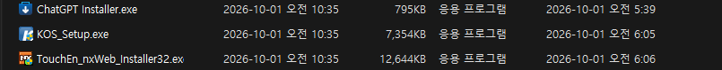
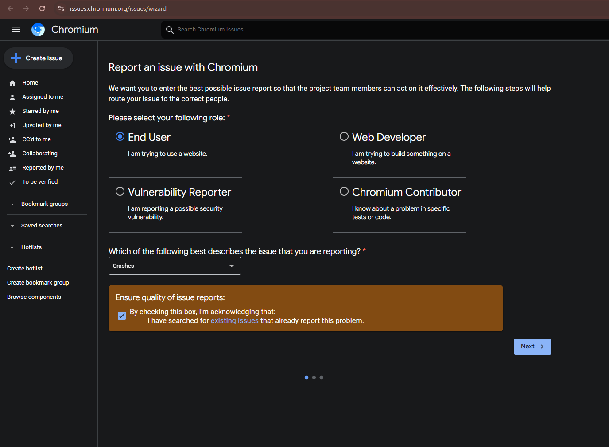

# 과정 일기: Chrome이 안 켜진 날

[← 분석 보고서(README)](../README.ko.md)

강의 자료로 쓰려고 남기는 기록이다. 결론만 정리한 README와 달리, 실제로 어떤 순서로 헤맸고 무엇을 보고 방향을 틀었는지를 시간순으로 적는다. 시각은 한국 시간이다. 따옴표 안의 말은 당시 내가 쓴 원문 그대로다.

## 한눈에 보기

| 시각 | 단계 |
|---|---|
| 10/01 06:05~06:07 | 정부 사이트용 보안 프로그램 설치 |
| 10/01 06:09 | Chrome 첫 충돌 |
| 10/02 01:1x | Chrome 삭제·재설치 → 여전히 안 켜짐 |
| 10/02 01:18 | 충돌 지점 확인: `GDI32.dll` |
| 10/02 01:2x | 일반적인 원인(글꼴, 드라이버 등) 점검 → 소득 없음 |
| 10/02 01:2x | "정부 프로그램 깔고 나서부터"라는 단서 → 보안 프로그램 추적 |
| 10/02 01:21 | KOS 제거(효과 없음) → TouchEn 제거 → **Chrome 정상** |
| 10/02 01:2x | 충돌 덤프 32개 분석으로 원리 규명(CET 섀도 스택) |
| 10/02 01:3x | GitHub 공개, Chromium 신고 시작 |

---

## 0. 발단: 정부 사이트용 프로그램 설치 (10/01 새벽)

정부 사이트를 쓰려다 설치 안내를 따라 프로그램 몇 개를 받았다. 다운로드 폴더 기록:



나중에 Windows 서비스 설치 기록(이벤트 ID 7045)으로 정확한 시각을 확인했다.

```
06:05:58  Service Name: Kings Online Security
06:07:00  Service Name: TENXW_Guard          ← TouchEn nxWeb
06:07:13  Service Name: CrossEX Live Checker
```

그리고 3분 뒤인 06:09:54에 Chrome이 처음 죽었다. 이때는 몰랐다.

## 1. 첫 대응: 삭제하고 다시 깔기 (10/02 01:1x)

> "제거해줘 chrome 삭제 원해 삭제후 재설치"

컴퓨터에 Chrome이 두 종류 있어서 무엇을 지울지 먼저 골랐다. 하나는 평소 쓰는 Google Chrome이고, 다른 하나는 개발 도구(Playwright)가 쓰는 Chromium이다. 평소 쓰는 Chrome을 골랐다.

```powershell
# 삭제 (관리자 권한 창이 뜸)
& "C:\Program Files\Google\Chrome\Application\154.0.8037.58\Installer\setup.exe" --uninstall --channel=stable --system-level --force-uninstall
# 결과: 종료 코드 19 = 정상 제거

# 재설치
winget install --id Google.Chrome -e --source winget
# 결과: "설치 성공", 154.0.8037.93
```

**결과: 그래도 안 켜졌다.**

> "이건 무슨 버그일까 그래도 chrome이 안열리네. 그냥 chrome 다 삭제해봐"

**실수하기 쉬운 곳:** 원인을 보지 않고 재설치부터 했다. 원인이 Chrome 밖에 있으면 재설치는 시간만 쓴다. 지우기 전에 이벤트 로그를 먼저 봐야 했다.

## 2. 어디서 죽는지 보기 (10/02 01:18)

Chrome을 직접 띄우고 Windows 이벤트 로그(Application, ID 1000)를 읽었다.

```
Faulting application name: chrome.exe, version: 154.0.8037.93
Faulting module name: GDI32.dll, version: 10.0.26100.8328
Exception code: 0xc0000409
Fault offset: 0x0000000000004b17
```

Chrome 자체가 아니라 Windows 화면 그리기 DLL(`GDI32.dll`)에서 죽고 있었다. 새 빈 프로필로 띄워 보는 시험도 준비했지만 건너뛰었다.

> "GDI32.dll -> 여기서 죽지 않게 해봐"

## 3. 일반적인 원인 점검: 헛걸음이 대부분 (10/02 01:2x)

GDI32 충돌의 흔한 원인부터 하나씩 확인했다.

| 확인한 것 | 결과 | 판단 |
|---|---|---|
| GDI 핸들 한도(레지스트리) | 10000, 기본값 | 정상 |
| 최근 추가된 글꼴 | 사용자 글꼴 1개(4월), 시스템 글꼴은 Windows 업데이트분 | 의심 약함 |
| **다른 프로그램도 같은 곳에서 죽나** | **원격 데스크톱·업데이트 알림도 `GDI32.dll+0x4b17`** | **결정적. Chrome 문제가 아님** |
| 10/01 이전 충돌 | 0건 | 10/01에 무언가 바뀜 |
| GDI 관련 DLL 버전 | `gdi32.dll` 8328, `gdi32full.dll` 9444 | 불일치처럼 보였지만 정상(업데이트 때 바뀐 파일만 갱신됨). **헛다리** |
| 재부팅 대기 | 일부 파일 교체 대기만 있음 | 무관 |
| 충돌 오프셋이 무슨 함수인가 | `BitBlt`(화면 복사 함수) | 화면 그리기 쪽 문제 |
| 그래픽 드라이버 | Intel·NVIDIA, 최근 변경 없음 | 무관 |

**실수하기 쉬운 곳:** 파일 버전이 서로 다르다고 손상으로 단정하기 쉽다. Windows 누적 업데이트는 바뀐 파일만 교체하므로 같은 묶음의 DLL끼리 버전이 달라도 정상이다.

## 4. 결정적 단서: "그 프로그램 깔고 나서부터" (10/02 01:2x)

로그만 보던 중에 내가 기억을 떠올렸다.

> "정부 프로그램 설치한이 후로 이상해졌어. 네가 후보군이었"

다운로드 폴더 스크린샷(0장)을 같이 보여 줬다. 설치 시각(06:05, 06:06)과 첫 충돌(06:09)이 3분 차이였다. 설치된 보안 프로그램을 모두 찾았다.

| 프로그램 | 설치 | 서비스 |
|---|---|---|
| Kings Online Security (KOS) | 10/01 | `KOS_Service` 실행 중 |
| TouchEn nxWeb (라온시큐어) | 10/01 | `TENXW_Guard` 실행 중 |
| iniLINE CrossEX | 10/01 | 자동 실행 |
| nProtect Online Security | **7/06** | 실행 중 → 예전부터 있었으니 제외 |

**고른 이유:** 로그에서 공통 원인을 찾는 것보다 "언제부터"를 맞추는 쪽이 훨씬 빨랐다. 3장에서 한 점검들은 모두 "무엇이 바뀌었나"를 모른 채 한 것이었다.

## 5. 하나씩 지우기 (10/02 01:20~01:21)

**KOS 먼저.** KOS에는 화면 캡처 방지 기능이 있어서, `BitBlt`를 가로챌 가능성이 가장 높아 보였다.

```powershell
Start-Process "C:\Program Files (x86)\Kings Online Security\Uninstall.exe" -Verb RunAs -Wait
# 서비스·파일 사라짐 확인
```

Chrome을 다시 띄웠다. **여전히 충돌**(01:20:59 덤프).

다음으로 TouchEn과 CrossEX를 함께 지우려 했다. 그 사이에 내가 TouchEn을 직접 지웠다.

> "touch 얘가 문제였는듯, chrome이된다."

확인 결과:
```
TouchEn service: False
TouchEn file:    False
CrossEX:         True    ← 아직 남아 있지만 Chrome은 정상
```

**실수하기 쉬운 곳:** 여러 개를 한꺼번에 지우면 무엇이 원인이었는지 알 수 없다. 하나씩 지우고 그때마다 확인해야 한다. KOS는 결과적으로 무관했다(덤프 32개 중 0건에 등장).

## 6. 고친 뒤에 "왜"를 파기 (10/02 01:2x~01:3x)

> "이거 github에 대대적으로 써줘 내 업적. 이거 분석 심층으로 하면 포트폴리오로도 가능하지 않을까 싶어"

고친 것만으로는 "지웠더니 됐다"에 그친다. 증거가 아직 컴퓨터에 남아 있을 때 원리를 확인했다.

1. **Chrome 충돌 덤프 32개 발견**: `%LOCALAPPDATA%\Google\Chrome\User Data\Crashpad\reports\*.dmp`
2. **`pip install minidump pefile`** 로 덤프를 파싱했다. 32개 모두에 `TENXWGuard64_051.dll`(TouchEn)이 들어 있었다.
3. **충돌 바이트 확인**: `gdi32.dll`의 0x4b17 바이트가 `c3`, 즉 `RET`(함수 복귀)였다.
4. **오류 하위 코드 확인**: 예외 인자 `0x39` = 57. Windows SDK `winnt.h`에서 찾았다.
   ```
   #define FAST_FAIL_CONTROL_INVALID_RETURN_ADDRESS    57
   ```
   CPU의 하드웨어 스택 보호(Intel CET 섀도 스택)가 "복귀 주소가 조작됐다"며 프로세스를 끊은 것이다.
5. **복귀 주소 비교**: 일반 스택의 복귀 주소는 어느 DLL에도 속하지 않는 메모리를 가리켰다. 섀도 스택에는 진짜 호출자(`USER32.dll`)가 남아 있었다.
6. **왜 일부 프로그램만 죽나**: 실행 파일 헤더의 `CETCOMPAT` 표시를 확인했다. Chrome과 원격 데스크톱은 켜져 있고, 메모장과 탐색기는 꺼져 있었다.
7. **숨은 용의자 하나 더**: MarkAny Image SAFER(`IMGSF50Filter_x64.dll`)가 덤프 15개에 있었다. 하지만 10/01 전부터 있었고, 지금도 Chrome 안에 로드된 채 정상이라 원인에서 뺐다.

자세한 표와 그림은 [README](../README.ko.md) 2장에 있다.

## 7. 공개하기 (10/02 01:3x)

**저장소 만들기**

```bash
git init -b main
gh repo create Sweet-Butters/chrome-cet-crash-touchen --public --source . --push
```

**올리지 않은 것과 이유**

| 항목 | 이유 |
|---|---|
| 덤프 원본 `*.dmp` | 프로세스 메모리가 담겨 있어 개인정보가 섞일 수 있다. 주소와 모듈 이름만 뽑아 `data/crashes.csv`로 올렸다 |
| 사용자 폴더 경로 | 스크린샷에서 경로 열을 잘라냈다 |
| 설치 프로그램 전체 목록 | 이번 일과 무관한 사생활 |
| 같은 날 찍은 다른 스크린샷 | 공문서에 주민등록번호·주소·전화번호가 보인다. **공개 저장소에 스크린샷을 올리기 전에는 한 장씩 직접 열어 본다** |

**언어:** GitHub README에는 언어 전환 버튼이 없다. 그래서 `README.md`(영어, 기본)와 `README.ko.md`(한국어)로 나누고 맨 위에 서로 넘어가는 링크를 달았다.

**보상 여부:** Chrome 보안 보상 프로그램(VRP)은 Chrome 자체의 취약점만 대상이다. 외부 프로그램과의 호환성 문제는 보상이 없다. 대신 공개 이슈 링크가 포트폴리오 근거가 된다.

## 8. Chromium에 신고하기 (10/02 01:32~)

`https://issues.chromium.org` 에서 Google 계정으로 로그인한 뒤 새 이슈를 만든다.

**1단계 화면**



- 역할: `End User`. 보안 취약점이 아니므로 Vulnerability Reporter가 아니다.
- 분류: `Crashes`
- 기존 이슈를 검색했다는 확인란에 체크

**2단계 화면(충돌 세부 정보)에 넣은 값**

| 칸 | 값 |
|---|---|
| Channel | `Stable` |
| Chrome version | `154.0.8037.93` |
| One line summary (100자 제한) | `Chrome exits on launch: TouchEn nxWeb BitBlt hook triggers CET shadow stack fast-fail 57` |
| Feedback report 보냈나 | `No`. TouchEn을 이미 지워서 지금 보내는 보고서에는 충돌이 담기지 않는다 |
| Steps to reproduce | TouchEn nxWeb 설치 → Chrome 실행 → 즉시 종료 (3줄) |
| Describe the problem | 환경, 덤프 분석 요약, 저장소 링크, Chrome 쪽 개선 제안(약 1,600자) |
| Did this work before? | `Yes`. TouchEn 설치 전에는 같은 버전이 정상 |

**3단계 화면(추가 정보)에 넣은 값**

| 칸 | 값 |
|---|---|
| Report ID from chrome://crashes | 없음. 이 PC는 충돌 보고 업로드가 꺼져 있어 로컬 덤프만 있다 |
| How severe is the crash? | 실행할 때마다 충돌, 브라우저를 전혀 쓸 수 없음 |
| Is it a problem with a plugin? | No |
| Additional comments | 업로드 ID가 없는 이유, 로컬 덤프 32개 보유, 요청하면 비공개로 제공 |
| Attachments | `crashes.csv`(덤프 요약표)만. **덤프 원본은 첨부하지 않는다.** 첨부 파일이 공개될 수 있고, 덤프에는 메모리가 담겨 있다 |

**실수하기 쉬운 곳:** 긴 본문은 클립보드에 넣어 두고 붙여 넣었다. 그런데 중간에 스크린샷을 찍으면 클립보드가 이미지로 바뀐다. 붙여 넣기 직전에 다시 복사해야 한다.

## 남은 단계

- [ ] Chromium 이슈 제출 → 이슈 링크를 README(영어·한국어)에 추가
- [ ] 라온시큐어 고객지원(기타 문의)에 같은 내용 전달 → 전달 날짜를 README에 추가
- [ ] 재부팅 한 번(메모리에 남은 흔적 정리)
- [ ] CrossEX는 남아 있다. 지금은 문제없지만 필요 없으면 제거
- [ ] 같은 정부 사이트를 다시 쓸 때 TouchEn 설치를 또 요구하면, Edge에서만 쓰고 끝나면 지운다

## 강의 포인트

1. **증상이 나온 곳과 원인이 있는 곳은 다르다.** 죽은 것은 Chrome이었지만 원인은 다른 회사 보안 프로그램이었다.
2. **"언제부터"가 가장 싼 증거다.** 로그를 30분 뒤진 것보다 기억 한 줄이 빨랐다. 사람의 관찰과 기계의 기록을 맞춰 본다.
3. **하나씩 바꾸고 매번 확인한다.** KOS를 먼저 지운 덕분에 KOS가 무관하다는 것이 증명됐다.
4. **고친 뒤에 증거가 사라지기 전에 "왜"를 판다.** 충돌 덤프는 시간이 지나면 지워진다.
5. **공개 전에 개인정보를 한 장씩 확인한다.** 같은 폴더에 공문서 스크린샷이 섞여 있었다.
